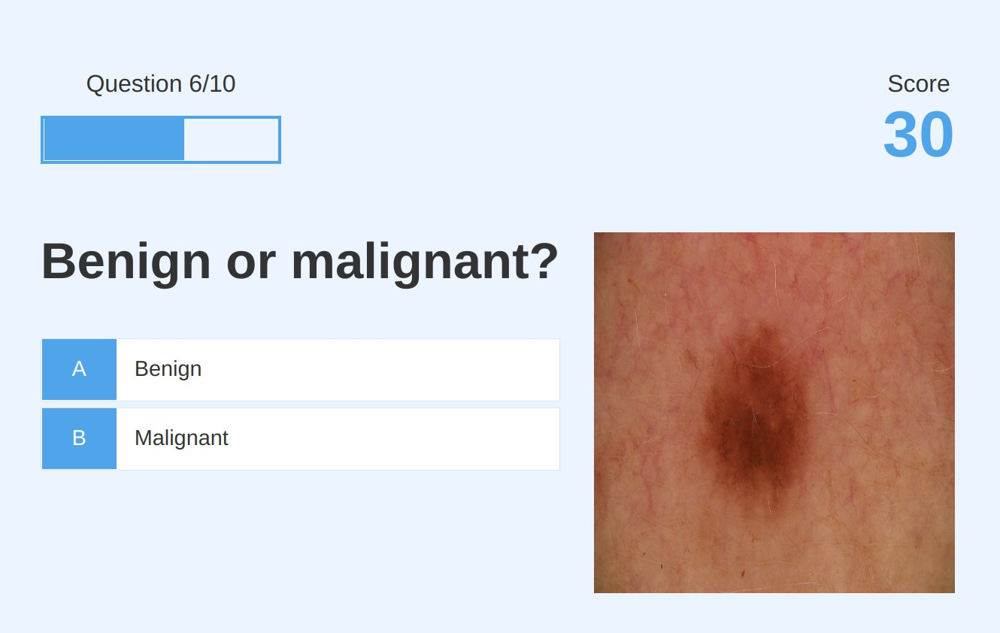

# Mole Training Quiz App

This is the code for a basic quiz website focused on training people to differentiate malignant moles (melanoma or non melanoma cancer) from benign moles and other skin marks. Mole images come from [ISIC Archive](https://www.isic-archive.com/).

You can try the website [here](https://moles.mathigatti.com/)

## Disclaimer

I haven't tested the website and I know nothing about skin cancer, don't take the website as a serious training.

